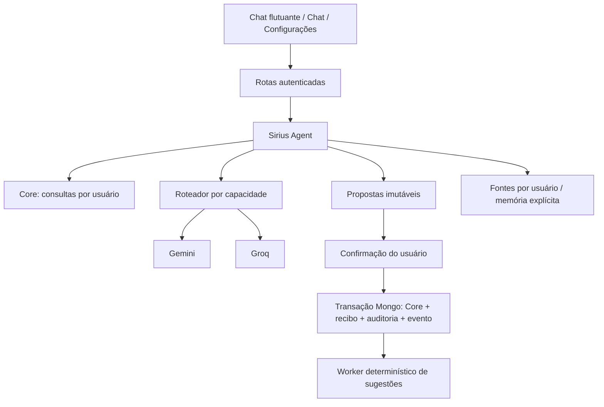

# Arquitetura de IA



`backend/ai/config.py` centraliza catálogo, capacidades, rotas por tarefa e flags. `providers/` concentra HTTP assíncrono, cabeçalhos de credenciais, arquivos, transcrição e síntese. `router.py` valida schemas JSON/Pydantic, classifica falhas e tenta somente modelos compatíveis. Falha de entrada não remove o schema para tentar aceitar dados sem validação. Não há repetição de mutação por fallback.

`core.py` é a camada de leitura; `core_writes.py` é compartilhado pelas rotas tradicionais de criação de tarefa/transação/sessão de estudo e pelo agente. `registry.py` versiona ferramentas e schemas sem aceitar `user_id` do modelo. `actions.py` revalida propriedade, argumentos, versão, prazo e política na confirmação. A transação existente serializa alterações por usuário; recibo, dados, XP, orçamento, auditoria e evento são confirmados juntos. Erros desfazem a transação; uma proposta não executada permanece pendente para nova tentativa/cancelamento.

`agent.py` recebe resultados como dados, fora das instruções de sistema. Não contém acesso direto ao Mongo. O planejador não recebe decisões de horário do modelo. Memórias não alteram permissões. Textos recuperados nunca autorizam ações; inclusive propostas geradas por conteúdo malicioso ainda exigem confirmação explícita.

Histórico recente e resumo são limitados antes da chamada. Leituras não usam cache duradouro de saldo/estado atual. Embeddings usam cache por usuário, hash do conteúdo, modelo e dimensão. Logs registram provedor, modelo, tarefa, latência, contadores e categoria de falha, sem prompts/chaves. `/api/ai/status` exige autenticação e distingue configuração de verificação real do provedor.

## Atlas Vector Search opcional

Crie um índice do tipo `vectorSearch` na coleção `ai_chunks`, somente em um cluster com suporte disponível, e informe seu nome em `AI_ATLAS_VECTOR_INDEX`:

```json
{"fields":[{"type":"vector","path":"vector","numDimensions":768,"similarity":"cosine"},{"type":"filter","path":"user_id"},{"type":"filter","path":"source_id"}]}
```

O filtro de usuário é aplicado antes da busca e novamente depois; a existência/propriedade da fonte é revalidada antes de retornar citações. Consulta e documentos usam o mesmo modelo e dimensão. Se o índice não estiver disponível, a resposta indica busca lexical. Nenhum cluster/upgrade pago é criado automaticamente. Referências: [MongoDB Vector Search](https://www.mongodb.com/docs/vector-search/), [Gemini Embeddings](https://ai.google.dev/gemini-api/docs/embeddings).

## Verificação

`test_ai_router_regression.py`: fallback, quotas, chaves inválidas, schemas, capacidades e separação de papéis. `test_agent_regression.py`: criptografia, migração, argumentos, planejamento, memória, RAG, parser literal e transações reais de confirmação concorrente/rollback em banco descartável. Testes anteriores continuam ativos. CI executa Mongo isolado, replica set, lint, unitários frontend, build e smoke Chromium em desktop/mobile. Sem chamadas reais de IA.

Consulte [SIRIUS_AGENT.md](SIRIUS_AGENT.md) para limites operacionais e [AI_MIGRATION_MAP.md](AI_MIGRATION_MAP.md) para os pontos migrados.
