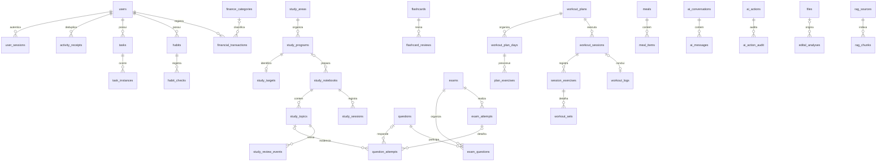

# Modelo relacional — fundação em desenvolvimento

O schema atual da branch tem 84 tabelas (Alembic `4e16ba167d61`). Não é ainda o schema completo de todos os módulos; o mapa de trabalho está em [DATABASE_REDESIGN_MAP.md](DATABASE_REDESIGN_MAP.md). O runtime de produção ainda não foi trocado.

Conversas usam chave externa por dono, lease com token/prazo e sequência de mensagens normalizadas. O resumo guarda extratos limitados; `context_from` separa o contexto recente do arquivo de até 200 mensagens. `ai_conversation_receipts` guarda os últimos 12 resultados idempotentes por conversa. A IA é chamada fora da transação; um escritor com lease substituído não pode salvar a resposta. Memórias bloqueadas apagam conteúdo/proveniência e preservam somente categoria/hash para impedir recriação.

`daily_summaries` guarda o resumo diário em campos tipados, com unicidade dono/data e validade de quatro horas verificada na leitura. Chamadas de IA ocorrem fora da transação; o writer revalida o cache depois de obter o lock do usuário.

`xp_entries` registra o delta efetivo de XP por dono e data civil, junto da alteração do usuário e recibo na mesma transação. Estornos são negativos; a repetição da ação não cria novo registro. Não há reconstrução/migração de histórico antigo.

Relatórios preservam um snapshot tipado por período: contagens, minutos, macronutrientes, valores financeiros NUMERIC e texto de insights. Não há documento genérico de persistência; cada métrica tem coluna e o dinheiro continua Decimal durante o cálculo.

Nutrição usa refeições/itens, água, metas, receitas/ingredientes e planos/dias/refeições/alimentos normalizados. Listas de compras têm itens e referência ao plano por dono. Dietas e planos gerados/importados compartilham `nutrition_plans`, diferenciados por `kind`; archive preserva referências. Totais explicitamente declarados em um documento importado ficam em `meals.reported_*`, pois não equivalem à soma dos nutrientes que a IA conseguiu extrair de cada alimento. Nas refeições manuais esses campos são nulos e os totais derivam dos itens e quantidades.

Os vínculos entre entidades privadas incluem `user_id` na FK, além do ID da entidade. Uma FK simples para users também existe nas tabelas privadas. Consultas continuam filtrando propriedade; a FK é defesa adicional.

QuestionAttempt preserva total/correct para fatos agregados e resposta/duração para tentativas individuais. StudySession preserva minutos, origem, início/término quando conhecidos. ReviewEvent e FlashcardReview são eventos, não apenas próximas datas. Nenhuma coluna de mastery substitui esses fatos.

Plano de treino preserva dia/semana/ordem, exercícios prescritos e uma cópia relacional na sessão. Alterações futuras da prescrição não reescrevem os fatos da sessão. Sets executados têm linhas próprias. Refazer uma confirmação usa recibo e não duplica o log.

Dinheiro usa NUMERIC(18,2); relatórios somam no SQL. `budgets.limit` guarda limite, enquanto gasto deve ser calculado das transações. Calendário usa instantes UTC e aplica timezone do usuário ao converter dia/minuto da API.

JSONB contém estruturas variáveis (evidência, parâmetros de IA, análise de edital, preferências e resultados). Campos de proprietário, IDs, datas, status, valores, mensagens e tentativas são relacionais. Arquivos têm somente metadata/referências; bytes não estão no schema.

CASCADE é usado para sessões de autenticação e índices de conteúdo descartáveis. Relações de histórico usam RESTRICT. Exclusões visíveis ao usuário ainda precisam ser adaptadas para preservar histórico sem gerar erros de constraint no frontend.
## Integração financeira adicional

Revisão `0e61828b3519` acrescenta `card_purchases`, `card_invoices`,
`financial_projections` e `monthly_bills` (60 tabelas no total). São entidades
tipadas, com NUMERIC(18,2), datas civis e referências compostas por proprietário.
Transações referenciam compra ou conta quando aplicável; parcelas futuras referenciam
a compra mesmo quando ainda não existe uma transação paga. Contas importadas de
projeções têm unicidade por usuário/projeção; pagamentos têm unicidade por conta.
Categorias passam a preservar ícone e cor usados pela interface.

Tarefas/hábitos usam `archived_at`; `task_instances` exige coerência entre status e
completed. Essas alterações correspondem à migração anterior `d18c704a928e`.

## Análises e fila de editais

`edital_analyses` separa identidade, hash, nome do arquivo, texto, páginas, versão, revisão de conferência e expiração da análise estruturada. `edital_jobs` persiste status, lease, referência de storage e resultado; FK composta impede ligar análise de outro dono. Excluir a análise limpa a referência no job e revoga suas fontes RAG. Binários não ficam no banco.

`study_schedules` guarda blocos semanais com horários tipados e FK de caderno/dono. `study_programs.edital_data` é o snapshot estruturado de concurso/cargo/estratégia/fonte da importação, não armazenamento genérico de documentos; as disciplinas, tópicos, sessões e blocos ficam normalizados. Campos de fonte/status dos pesos e questões pertencem ao caderno.

`study_tasks` e `study_task_checks` preservam o contrato de tarefas de estudo (caderno opcional, prazo/lembrete, minutos e recorrência), distinto das tarefas gerais com data obrigatória. Checks normalizados têm FK composta, unicidade diária e XP efetivamente concedido para desfazer corretamente. Migration `13ef5c5fbe1f`; 64 tabelas.

`study_mindmaps` guarda título, fonte, FK opcional de caderno e árvore específica de nós; `study_essay_corrections` guarda arquivo, instruções e avaliação estruturada da redação. Não são coleções genéricas. Head `d04654f48d58`, 66 tabelas.

Migration `cb8efdf00b9f` preserva `ai_generated` e `source_pdf` de notas e cartões. Os materiais de PDF usam as mesmas tabelas normalizadas de notas/cartões/Exam/Question, com caderno obrigatório e transação única.

Migration `b91a1161f708` acrescenta archive a planos de treino e divisão/foco/notas de progressão a cada dia normalizado. Editar dias não altera os exercícios já copiados para uma sessão. Planos arquivados deixam de aceitar novas sessões, mantendo os registros existentes.

Migration `c20af75ad6b0` acrescenta resumo de melhorias e `improved_from`, uma FK composta que exige o mesmo dono do plano original. O conteúdo de dias e exercícios continua normalizado; parâmetros de geração guardam apenas as opções específicas e progressão semanal.

Migration `99b09cc30936`: exercícios de registros manuais usam `workout_log_exercises`; séries reutilizam `workout_sets`, com constraint de exatamente uma origem e FKs compostas. Logs gerados por sessões referenciam a sessão e reutilizam seus exercícios, sem cópias redundantes. Total: 67 tabelas.

Migration `6460b39c74a1`: `daily_workout_status` único por dono/plano/data e `daily_workout_checks` por índice do exercício. Conclusão referencia um log do mesmo dono. Excluir log limpa a referência; reset desfaz a conclusão e XP em uma transação. Total: 69 tabelas.
